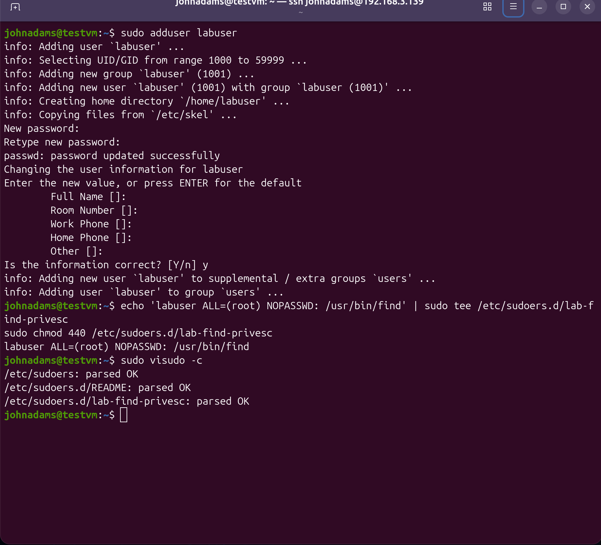
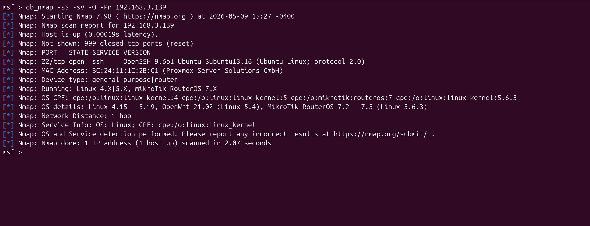
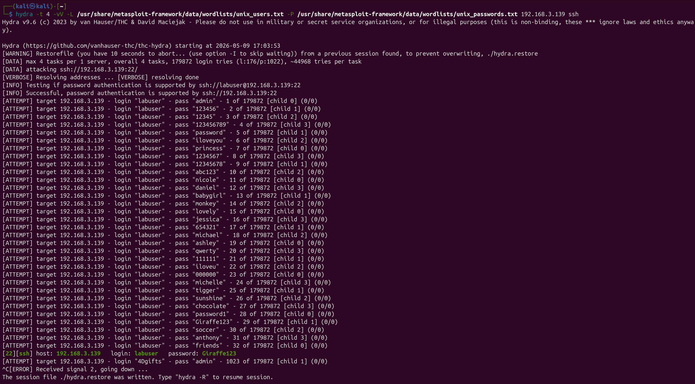
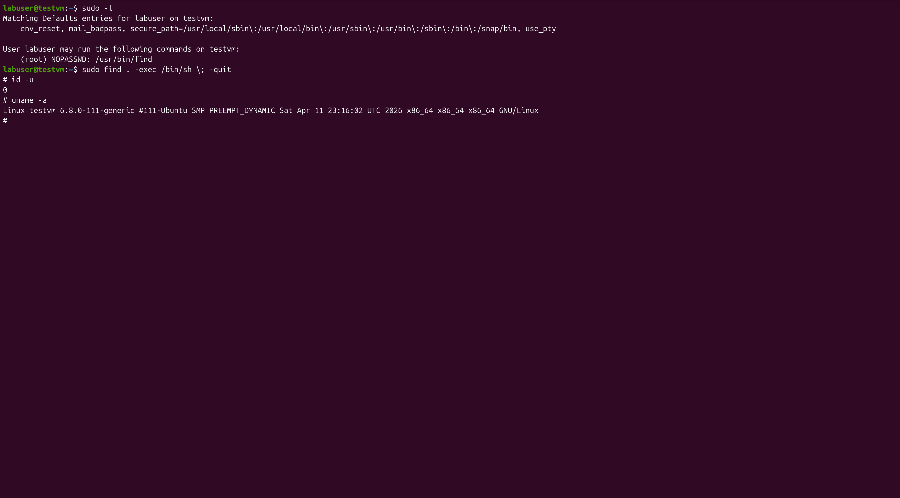
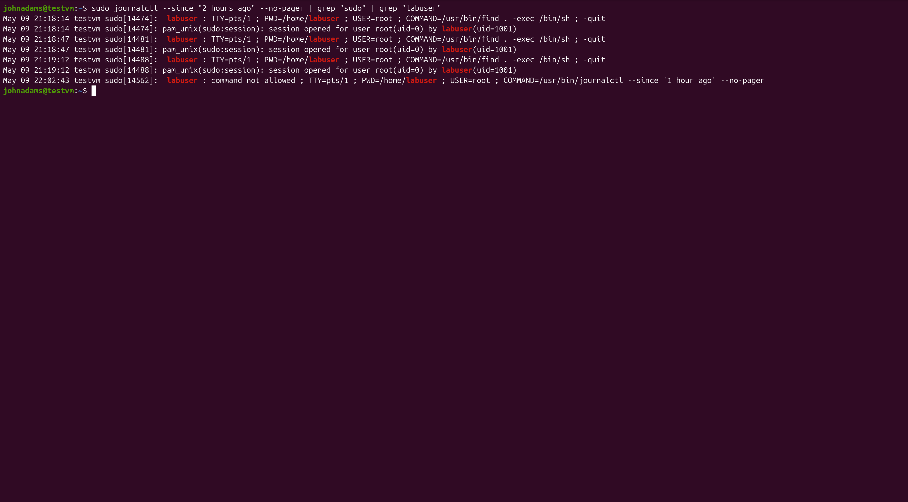
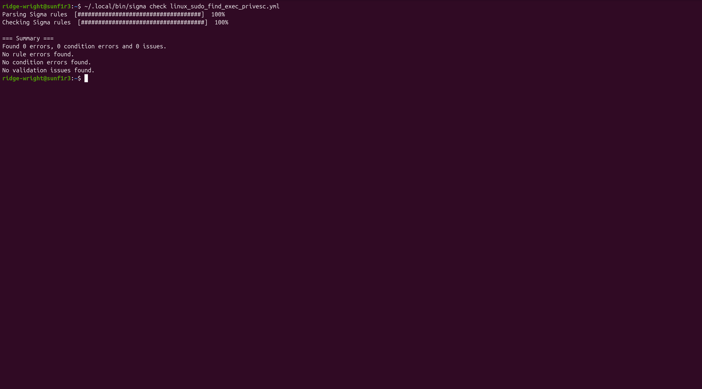

# Sigma Detection Rule Write-Up: Linux Privilege Escalation via Sudo Find

## Overview

This write-up documents a Sigma detection concept for identifying suspicious Linux privilege escalation behavior involving the abuse of the `find` binary through `sudo`.

In Linux environments, privilege escalation often comes from misconfigured permissions rather than complex exploits. One common example is when a low-privileged user is allowed to run certain binaries as root using `sudo`. If those binaries can execute system commands, an attacker may be able to abuse them to spawn a root shell.

The `find` command is one example of a legitimate Linux utility that can become dangerous when granted elevated permissions. Because `find` supports the `-exec` option, it can be used to execute another command, including a shell such as `/bin/sh`.

This write-up walks through the attack concept, why the behavior is risky, and how a Sigma rule could be used to detect suspicious usage in Linux authentication logs.

## Lab Objective

The objective of this lab is to document a detection engineering use case for identifying possible privilege escalation attempts using `sudo find -exec`.

This lab focuses on:

- Understanding how `find` can be abused for privilege escalation
- Identifying suspicious command patterns in Linux logs
- Writing Sigma detection logic
- Mapping the activity to MITRE ATT&CK
- Recommending defensive controls to reduce risk

## Attack Scenario

An attacker gains access to a low-privileged Linux account and begins enumerating the system for privilege escalation opportunities. One of the first commands they may run is:

One of the first commands they may run is:

<pre><code>sudo -l</code></pre>

This command shows which programs the current user is allowed to run with elevated privileges.

In this scenario, the attacker discovers that the user can run /usr/bin/find as root. This is dangerous because find can execute commands through the -exec option.

A potential privilege escalation command may look like this:

<pre><code>sudo find . -exec /bin/sh \; -quit</code></pre>

If successful, this command could spawn a shell running with elevated privileges.

## Lab Setup & Execution

To start, I created a Victim VM running Ubuntu 24.04 on my proxmox server.

I then create a non-privileged local user account on our victim VM, and set a rule to allow the test account to run `sudo` with no password to execute /usr/bin/find.

Once that was all setup, I moved over to my kali machine and did some reconnaissance. To save time, I directly scanned the host IP.

I noticed an open ssh port on the victim host, so i decided to compile a username and password wordlist and perform a brute force on the ssh login using hydra.

We have identified credentials that we can use to login to the victim with via ssh.
I will now perform the commands below and look at the accounts sudo permissions,
then execute the second command below to gain access to a privileged shell:

<pre><code>sudo -l</code></pre>
<pre><code>sudo find . -exec /bin/sh \; -quit</code></pre>

We now have an escalated permissions shell session! So, this attack path is what we will be writing a sigma rule for.

Lastly, I will verify this showed up on logs, I checked inside of journalctl and here it is:

## Detection Engineering

  After completing the attack path, the next step was to think through how this behavior could be detected from a defensive perspective.
  The goal of the detection was to identify suspicious sudo activity where the <code>find</code> binary is used to execute a shell.

  This behavior is suspicious because <code>find</code> is a legitimate Linux utility, but when it is executed with elevated privileges and combined with the <code>-exec</code> option, it can be abused to spawn a root shell.

<h3>Detection Goal</h3>

  The detection goal is to alert when Linux authentication logs show a user executing <code>/usr/bin/find</code> through <code>sudo</code> with command execution behavior that may indicate privilege escalation.

<h3>Log Source</h3>

  The primary log source for this detection is Linux authentication logging. On Ubuntu systems, this activity may appear in <code>/var/log/auth.log</code> or through <code>journalctl</code>.

<h3>Suspicious Indicators</h3>

<ul>
  <li>Successful SSH login as a low-privileged user</li>
  <li>Use of <code>sudo -l</code> to enumerate privileges</li>
  <li>Execution of <code>/usr/bin/find</code> through <code>sudo</code></li>
  <li>Use of the <code>-exec</code> option</li>
  <li>Execution of a shell such as <code>/bin/sh</code></li>
</ul>

<h3>Sigma Rule Development</h3>

  Based on the observed attack behavior, I created a Sigma rule that looks for sudo log messages containing the key command elements associated with this privilege escalation technique.

<pre><code>title: Linux Privilege Escalation Attempt Via Sudo Find Exec
status: experimental
description: Detects possible Linux privilege escalation using sudo find with -exec to spawn a shell.
author: Ridge Wright
logsource:
  product: linux
  service: auth
detection:
  selection:
    message|contains|all:
      - 'sudo'
      - 'find'
      - '-exec'
      - '/bin/sh'
  condition: selection
fields:
  - timestamp
  - hostname
  - user
  - message
falsepositives:
  - Administrative testing
  - Security labs
level: high
tags:
  - attack.privilege-escalation
  - attack.t1548</code></pre>

<h2>Detection Engineering and Sigma Rule Validation</h2>

  After completing the attack path, I reviewed the victim machine's authentication logs to identify what evidence was created by the activity. 
  The goal was to determine which log artifacts could be used to detect the privilege escalation behavior from a defensive perspective.

  The most important log evidence was the sudo command showing <code>labuser</code> executing <code>/usr/bin/find</code> with elevated privileges. 
  Since the attack used the <code>-exec</code> option to launch <code>/bin/sh</code>, those command elements became the basis for the detection logic.

<h3>Detection Goal</h3>

  The goal of this detection is to identify suspicious sudo activity where the <code>find</code> binary is used to execute a shell. 
  While <code>find</code> is a legitimate Linux utility, it can become dangerous when a low-privileged user is allowed to run it as root.

<h3>Observed Indicators</h3>

<ul>
  <li>SSH authentication activity for <code>labuser</code></li>
  <li>Sudo privilege enumeration using <code>sudo -l</code></li>
  <li>Execution of <code>/usr/bin/find</code> through sudo</li>
  <li>Use of the <code>-exec</code> option</li>
  <li>Execution of <code>/bin/sh</code> from the elevated command</li>
</ul>

<h3>Sigma Rule Creation</h3>

  Based on the observed log evidence, I created a Sigma rule to detect this behavior in Linux authentication logs.

<pre><code>title: Linux Privilege Escalation Attempt Via Sudo Find Exec
id: 4d8f5c9a-5fd5-4a9c-9b51-2a73e2d12f42
status: experimental
description: Detects possible Linux privilege escalation using sudo find with -exec to spawn a shell.
author: Ridge Wright
date: 2026-05-09
logsource:
  product: linux
  service: auth
detection:
  selection:
    message|contains|all:
      - 'COMMAND=/usr/bin/find'
      - '-exec'
      - '/bin/sh'
  condition: selection
fields:
  - timestamp
  - hostname
  - user
  - message
falsepositives:
  - Administrative testing
  - Security labs
level: high
tags:
  - attack.privilege-escalation
  - attack.t1548</code></pre>

<h3>Rule Validation</h3>

  After creating the rule, I used Sigma CLI to validate the rule syntax and confirm that the rule was structured correctly.

<pre><code>~/.local/bin/sigma check linux_sudo_find_exec_privesc.yml</code></pre>

  The rule successfully passed validation, confirming that the Sigma rule was syntactically valid and ready to be converted for a supported SIEM backend.

<h3>SIEM Deployment Considerations</h3>

  This lab focused on writing and validating the Sigma rule rather than deploying it into a production SIEM. 
  In a real environment, this Sigma rule could be converted into a SIEM-specific query using Sigma CLI and then tuned against the organization's Linux authentication logs.

<h2>Defensive Recommendations</h2>

  This lab shows how a simple sudoers misconfiguration can create a serious privilege escalation path. 
  The main defensive takeaway is that administrative permissions should be reviewed carefully, especially when they allow users to run binaries that can execute other commands.

<ul>
  <li>
    Regularly review <code>/etc/sudoers</code> and files inside <code>/etc/sudoers.d/</code> for risky permissions.
  </li>
  <li>
    Avoid granting <code>NOPASSWD</code> permissions unless there is a clear operational need.
  </li>
  <li>
    Do not allow low-privileged users to run command-execution-capable binaries as root, such as <code>find</code>, <code>vim</code>, <code>less</code>, <code>awk</code>, <code>bash</code>, or <code>python</code>.
  </li>
  <li>
    Compare sudo permissions against known GTFOBins techniques to identify binaries that may be abused for privilege escalation.
  </li>
  <li>
    Monitor Linux authentication logs for suspicious sudo activity, especially commands containing <code>-exec</code>, <code>/bin/sh</code>, <code>/bin/bash</code>, or other shell-spawning behavior.
  </li>
  <li>
    Alert on unusual sudo usage by low-privileged users, especially after successful SSH logins from unfamiliar hosts.
  </li>
  <li>
    Use centralized logging or a SIEM to collect Linux authentication logs so suspicious privilege escalation behavior can be detected across multiple systems.
  </li>
  <li>
    Apply the principle of least privilege by only granting users the exact permissions needed for their role.
  </li>
</ul>

<h2>Conclusion</h2>

  This lab demonstrated a complete attack and detection workflow against an Ubuntu Linux victim machine. 
  The attack path began with SSH credential brute forcing against a low-privileged user account, followed by sudo privilege enumeration and privilege escalation through a misconfigured <code>/usr/bin/find</code> permission.

  After completing the attack, I reviewed the victim machine's authentication logs to identify the evidence created by the activity. 
  The sudo log entry showing <code>labuser</code> executing <code>/usr/bin/find</code> with the <code>-exec</code> option provided a clear detection opportunity.

  I then created a Sigma rule to detect this behavior and validated the rule using Sigma CLI. 
  This confirmed that the rule was syntactically valid and could be converted for use in a supported SIEM backend.

  Overall, this project demonstrates the connection between offensive security testing and defensive detection engineering. 
  By understanding how an attacker abuses a Linux misconfiguration, defenders can build more effective detections, improve logging coverage, and reduce the risk of privilege escalation in production environments.

