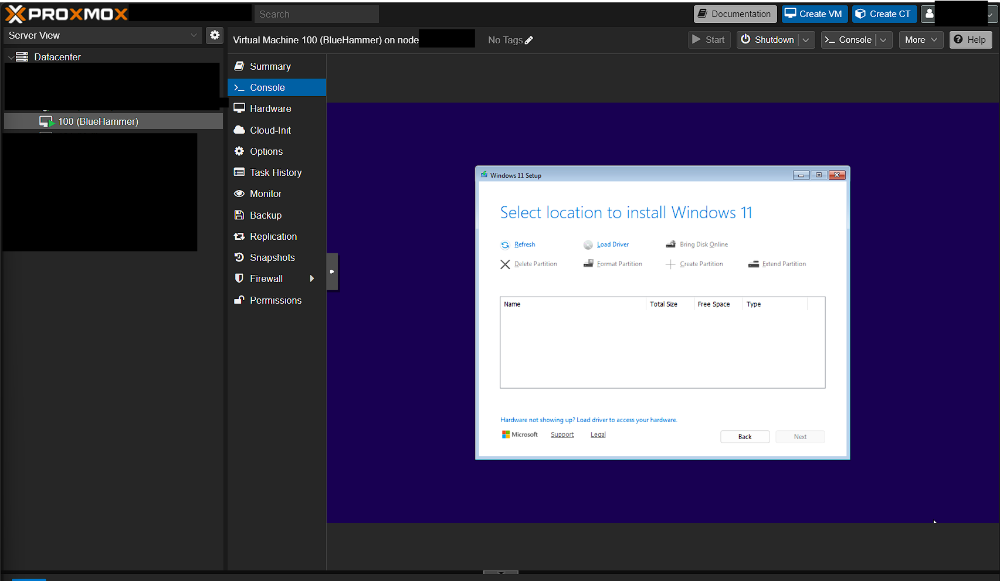
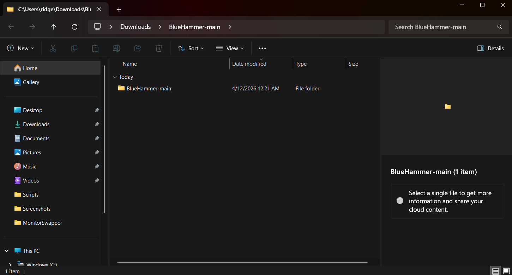
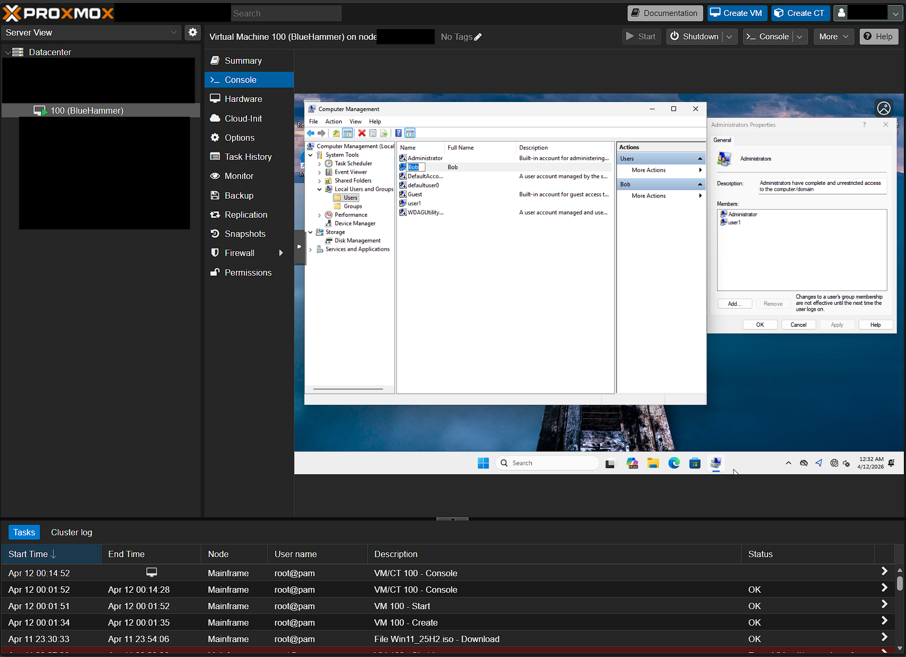
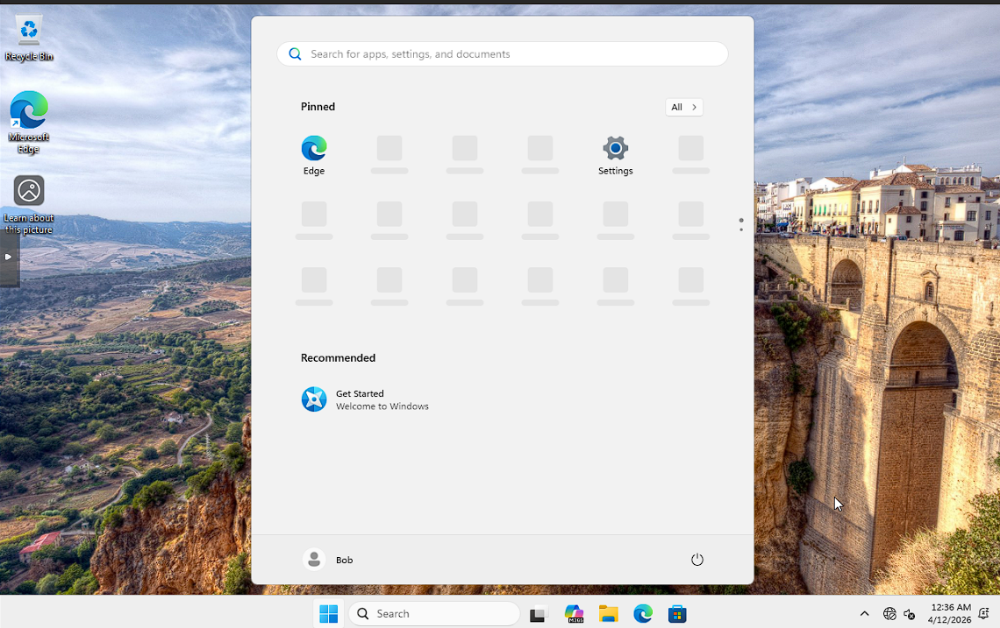

# BlueHammer Vulnerability Utilization and Analysis

Welcome! I am going to be using and analyzing the BlueHammer LPE (Local Privilege Exploit) vulnerability released on April 3, 2026.
This exploit was found by a cybersecurity researched that goes by "Nightmade Ecplise" who found an exploit that abuses Defneders update process with shadow vloume abuse, this allows a non-privileged user to escalate their privilege to NT AUTHORITY\SYSTEM.

The exploit code is a PoC code made public on his github:
 https://github.com/Nightmare-Eclipse/BlueHammer

My first step was to spin up a Win11 VM in my proxmox Host server:

My next step was to download download the vulnerability on my device, and load the project into Visual Studio so that i could package it ####as a singular .exe that would pass the runtime enviroment on the device. I will move this .exe over to my kali linux machine.

Setup a verified non-admin user on the test VM:

Once inside of the host device, I will push this payload and execute it as the user to escalate my privileges to NT AUTHORITY\SYSTEM
Here is the exploit running in action:

<iframe src="https://www.youtube.com/embed/8b7tB3D6kAU?rel=0" style="top: 0; left: 0; width: 100%; height: 100%; position: absolute; border: 0;" allowfullscreen scrolling="no" allow="accelerometer *; clipboard-write *; encrypted-media *; gyroscope *; picture-in-picture *; web-share *;" referrerpolicy="strict-origin"></iframe>

