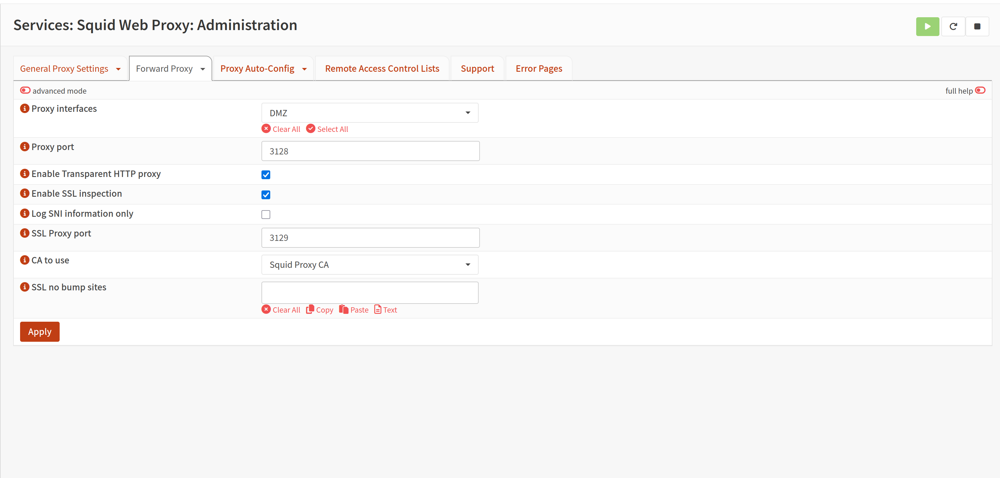
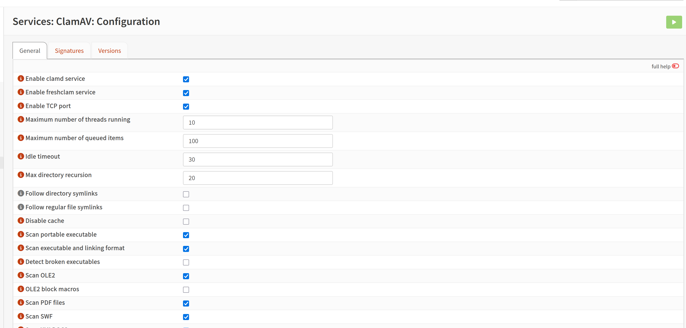

# Secure Web Gateway Lab


## Overview

This project documents the buildout of a Secure Web Gateway using OPNsense, Squid Proxy, C-ICAP, ClamAV, and Wazuh. The goal of the lab was to simulate an enterprise web security control that forces client web traffic through a proxy, scans downloaded content for malware, blocks malicious files, and forwards security events into a SIEM for centralized visibility.

The final result was a working proxy-based web gateway where client traffic was routed through Squid on OPNsense, inspected through C-ICAP, scanned by ClamAV, blocked when malware was detected, and logged into Wazuh through syslog forwarding.

---

## Lab Goals

- Route client web traffic through an OPNsense-based proxy.
- Use Squid as the Secure Web Gateway proxy service.
- Integrate Squid with C-ICAP for content inspection.
- Use ClamAV as the malware scanning engine.
- Validate malware blocking with the EICAR antivirus test file.
- Forward OPNsense, Squid, C-ICAP, and ClamAV logs to Wazuh using syslog.
- Document the architecture, rules, validation steps, and troubleshooting process.

---

## Infrastructure

### Network Flow

```text
Client Workstation
        |
        | Web traffic forced through proxy
        v
OPNsense Firewall / Secure Web Gateway
        |
        | Squid Proxy
        v
C-ICAP Service
        |
        | Malware scan request
        v
ClamAV / clamd

OPNsense Logs
        |
        | Syslog forwarding
        v
Wazuh SIEM
```

### System Roles

| Component | Purpose |
|---|---|
| OPNsense | Firewall, routing, proxy hosting, ICAP integration, and remote log forwarding. |
| Squid Proxy | Forward proxy and web traffic enforcement point. |
| C-ICAP | ICAP service used by Squid for content scanning. |
| ClamAV | Malware scanning engine used by C-ICAP. |
| Wazuh | SIEM used for centralized logging and security visibility. |
| Windows Client | Test endpoint behind the gateway. |

## Wazuh Deployment

Wazuh was deployed as a Docker-based SIEM server on a Linux VM. This provided a centralized location to receive and review firewall, proxy, and security events from OPNsense.

### 1. Set the Required Kernel Parameter

```bash
sudo sysctl -w vm.max_map_count=262144
echo "vm.max_map_count=262144" | sudo tee /etc/sysctl.d/99-wazuh.conf
sudo sysctl --system
```

### 2. Pull the Wazuh Docker Repository

```bash
git clone https://github.com/wazuh/wazuh-docker.git -b v4.14.5
cd wazuh-docker/single-node/
```

### 3. Generate Certificates

```bash
sudo docker compose -f generate-indexer-certs.yml run --rm generator
```

### 4. Start Wazuh

```bash
sudo docker compose up -d
```

### 5. Verify Containers

```bash
sudo docker compose ps
```

After deployment, the Wazuh dashboard was accessed from a browser.

```text
https://<WAZUH-SERVER-IP>
```

---

## Wazuh Syslog Configuration

Wazuh was configured to receive syslog events from OPNsense.

The Wazuh manager configuration was edited from the Wazuh Docker directory.

```bash
sudo nano config/wazuh_cluster/wazuh_manager.conf
```

The following syslog listener was added inside the main `<ossec_config>` block.

```xml
<remote>
  <connection>syslog</connection>
  <port>514</port>
  <protocol>udp</protocol>
  <allowed-ips>10.10.40.1/32</allowed-ips>
</remote>
```

The Wazuh stack was then restarted.

```bash
sudo docker compose down
sudo docker compose up -d
```

The syslog listener was validated with the following command.

```bash
sudo ss -lunp | grep ':514'
```

---

## OPNsense Plugin Configuration

The following OPNsense plugins were installed and used for the Secure Web Gateway build.

| Plugin | Purpose |
|---|---|
| `os-squid` | Provides the Squid web proxy service. |
| `os-clamav` | Provides ClamAV malware scanning. |
| `os-c-icap` | Provides the ICAP service used to connect Squid and ClamAV. |

These plugins provided the proxy, malware scanning, and ICAP integration needed for the lab.

---

## Squid Proxy Configuration



Squid was configured as the primary web proxy inside OPNsense.

**OPNsense menu path:**

```text
Services -> Squid Web Proxy -> Administration
```

### Proxy Listener Settings

| Setting | Value |
|---|---|
| Proxy Port | `3128` |
| Listening Interface | `LAN` |
| Allowed Clients | Internal client subnet |

The Windows client was configured to auto utilize any proxys for traffic.
I verified this by blocking the google domain and trying to browse to it.

```bash
tail -f /var/log/squid/access.log
```

---

## ClamAV Configuration



ClamAV was enabled from the OPNsense web interface.

**OPNsense menu path:**

```text
Services -> ClamAV
```

### Enabled Options

- Enable `clamd` service.
- Enable `freshclam` service.
- Enable TCP Port.

ClamAV signatures were downloaded and confirmed to be up to date.

- `daily.cvd`
- `main.cvd`
- `bytecode.cvd`

The ClamAV daemon was validated from the OPNsense shell.

```bash
sockstat -l | grep -Ei 'clamd|3310|clam'
```

Expected result:

```text
clamd listening on 127.0.0.1:3310
clamd socket available at /var/run/clamav/clamd.sock
```

---

## ClamAV Log Forwarding to Wazuh

ClamAV was configured to provide malware verdict logs for the Secure Web Gateway lab. Squid and C-ICAP handled proxy inspection, while ClamAV generated the final detection result.

### Log File Setup

A local ClamAV log file was created and monitored for malware detections:

```sh
touch /var/log/clamd.log
tail -F /var/log/clamd.log
```

Example detection:

```text
Mon May 18 01:27:57 2026 -> /var/tmp/CI_TMP_E1vXM3: Eicar-Test-Signature FOUND
```

### Log Forwarder

A lightweight script was created to watch `/var/log/clamd.log`, identify detection lines containing `FOUND`, tag them as Secure Web Gateway events, and forward them directly to Wazuh over UDP/514.

```text
/var/log/clamd.log
        ↓
swg-clamav-log-forwarder.sh
        ↓
Wazuh UDP/514
        ↓
Custom Wazuh Rule
```

The forwarder was started with:

```sh
chmod +x /usr/local/sbin/swg-clamav-log-forwarder.sh
daemon -f -p /var/run/swg_clamav_log_forwarder.pid /usr/local/sbin/swg-clamav-log-forwarder.sh
```

Forwarding was validated with:

```sh
tail -n 40 /var/log/clamav-forwarder.log
```

Example output:

```text
Forwarding malware detection: Mon May 18 01:27:57 2026 -> /var/tmp/CI_TMP_E1vXM3: Eicar-Test-Signature FOUND
```

### Wazuh Rule

A custom Wazuh rule was created to alert on forwarded ClamAV detections.

```xml
<group name="secure_web_gateway,clamav,malware,">

  <rule id="100240" level="12">
    <match>event_type=opnsense_swg_clamav</match>
    <regex type="pcre2">(?i)\bFOUND\b</regex>
    <description>ClamAV malware detection from Secure Web Gateway inspection</description>
    <group>secure_web_gateway,clamav,malware,detected,</group>
  </rule>

  <rule id="100241" level="12">
    <match>event_type=opnsense_swg_clamav</match>
    <regex type="pcre2">(?i)Eicar-Test-Signature.*\bFOUND\b</regex>
    <description>Secure Web Gateway detected EICAR test malware through ClamAV</description>
    <group>secure_web_gateway,clamav,malware,eicar,detected,</group>
  </rule>

</group>
```

## C-ICAP Configuration

C-ICAP was enabled from the OPNsense web interface.

**OPNsense menu path:**

```text
Services -> C-ICAP
```

### Enabled Options

- Enable `c-icap` service.
- Enable ClamAV.
- Disable pass on error.

C-ICAP was validated from the shell.

```bash
sockstat -l | grep -Ei 'c-icap|1344'
```

Expected result:

```text
c-icap listening on port 1344
```

---

## Squid, C-ICAP, and ClamAV Integration

Squid was configured to send web requests and web responses to C-ICAP for antivirus scanning. C-ICAP then handed files to ClamAV for malware inspection.

**OPNsense menu path:**

```text
Services -> Squid Web Proxy -> Administration -> Forward Proxy -> ICAP Settings
```

### ICAP URLs

| ICAP Setting | Value |
|---|---|
| Request Modify URL | `icap://[::1]:1344/avscan` |
| Response Modify URL | `icap://[::1]:1344/avscan` |

The generated Squid configuration was verified from the OPNsense shell.

```bash
grep -iE 'icap|avscan|adaptation|bypass' /usr/local/etc/squid/squid.conf
```

Relevant Squid configuration:

```text
icap_enable on
icap_service response_mod respmod_precache icap://[::1]:1344/avscan
icap_service request_mod reqmod_precache icap://[::1]:1344/avscan

adaptation_access response_mod allow localnet
adaptation_access request_mod allow localnet
adaptation_access response_mod deny all
adaptation_access request_mod deny all
```

This confirmed that Squid was configured to send both web requests and web responses to the ICAP antivirus scanning service.

---

## Firewall Rules Created

Firewall rules were created to enforce the Secure Web Gateway path and prevent clients from bypassing the proxy.

### Allow Client Access to Proxy

| Field | Value |
|---|---|
| Action | Pass |
| Source | Client subnet |
| Destination | OPNsense LAN address |
| Port | `TCP/3128` |
| Purpose | Allow clients to use the Squid proxy. |

### Block Direct Web Bypass

| Field | Value |
|---|---|
| Action | Block |
| Source | Client subnet |
| Destination | Any |
| Ports | `TCP/80`, `TCP/443` |
| Purpose | Prevent clients from bypassing the proxy. |

## OPNsense Remote Logging

OPNsense was configured to forward logs to Wazuh.

**OPNsense menu path:**

```text
System -> Settings -> Logging -> Targets
```

### Remote Syslog Target

| Setting | Value |
|---|---|
| Enabled | Yes |
| Transport | UDP |
| Destination | Wazuh Server IP |
| Port | `514` |
| Applications | firewall, squid, c-icap |

This allowed OPNsense firewall, proxy, and malware scanning events to be forwarded into Wazuh for centralized visibility.

---

### Validation

Wazuh ingestion was confirmed by monitoring UDP/514 traffic on the Wazuh server:

```sh
sudo tcpdump -A -s 0 -ni any udp port 514 | grep -iE 'clamav-swg|opnsense_swg_clamav|Eicar|FOUND'
```

After downloading the EICAR test file through the Secure Web Gateway, ClamAV logged the detection, the forwarder sent it to Wazuh, and the custom Wazuh rule generated a malware alert.

[ClamAV_Block.webm](https://github.com/user-attachments/assets/f849d5a6-9861-48ec-9d73-2133215ec32c)

Wazuh SIEM Events:


SIEM Event Details:


## Final Result

The lab successfully implemented a Secure Web Gateway with malware scanning and SIEM visibility! I can now spend time trying out the wazuh agent on endpoints, and pushing syslog of my docker server and Proxmox server to wazuh. This will allow greater visibility into my infrastructure, and endpoints to ensure a secondary security control is in place for malware detection. This proy also gives me granular control over blocking certain domains, and IP addresses.

### Final Validated Traffic Flow

```text
Client Workstation
        |
        v
Squid Proxy on OPNsense
        |
        v
C-ICAP Antivirus Service
        |
        v
ClamAV Malware Scan
        |
        v
Malicious File Blocked
        |
        v
Logs Forwarded to Wazuh
```

---

## Skills Demonstrated

- Secure Web Gateway architecture.
- OPNsense firewall and service configuration.
- Squid forward proxy configuration.
- ICAP-based content inspection.
- ClamAV malware scanning integration.
- Firewall rule design for proxy enforcement.
- Remote syslog forwarding.

---

## Summary

This lab demonstrates how an open-source firewall and proxy stack can be used to approximate enterprise Secure Web Gateway behavior. By combining OPNsense, Squid, C-ICAP, ClamAV, and Wazuh, the environment provided controlled web access, malware scanning, block validation, and centralized SIEM visibility. By utilizing Wazuh to write custom detection rules, I can setup indicators of compromise from certain popular attacks, and start monitoring and responding to them. This lab will be a great addition, that will give me the ability to try multiple different security concepts and allow me to showcase more cybersecurity skills.

