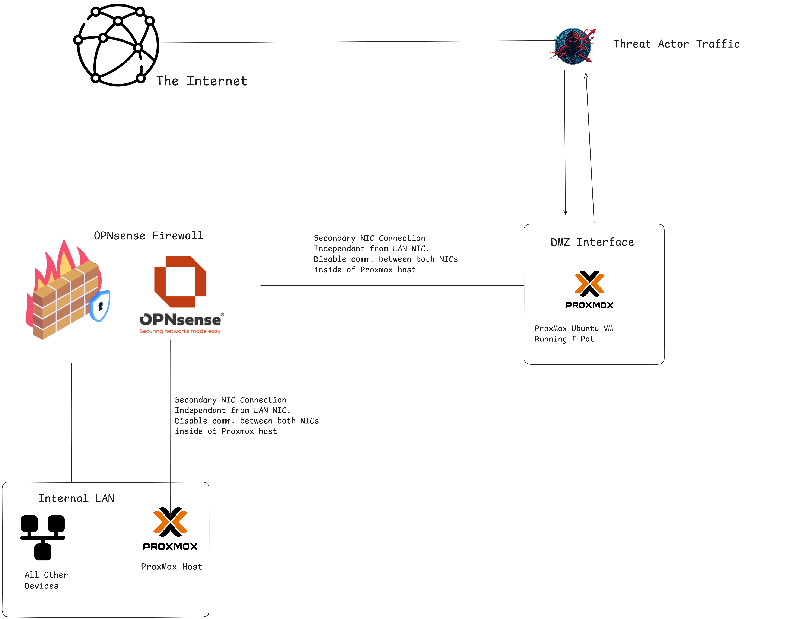
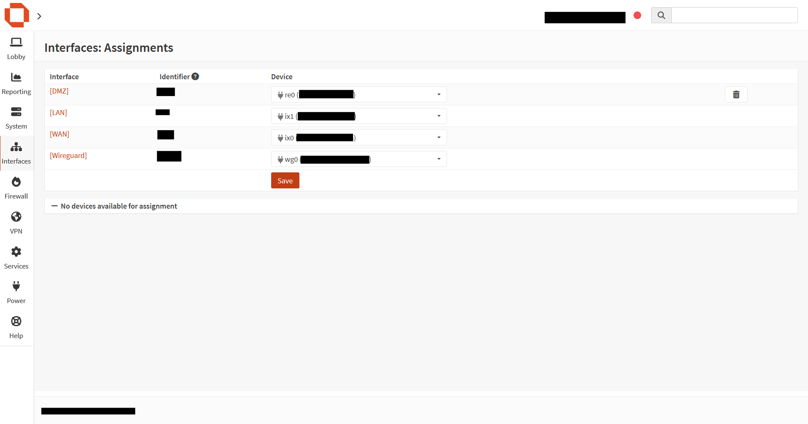
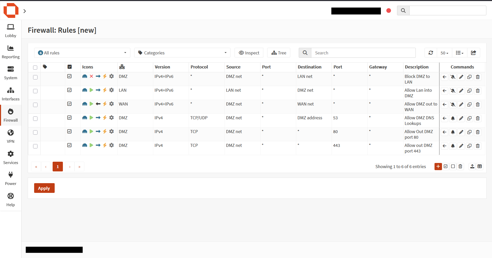
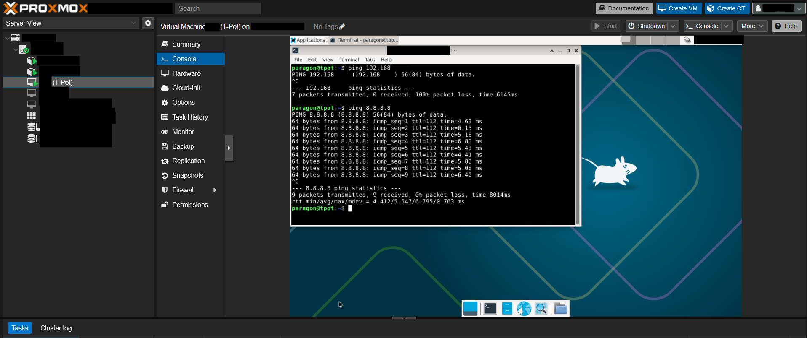
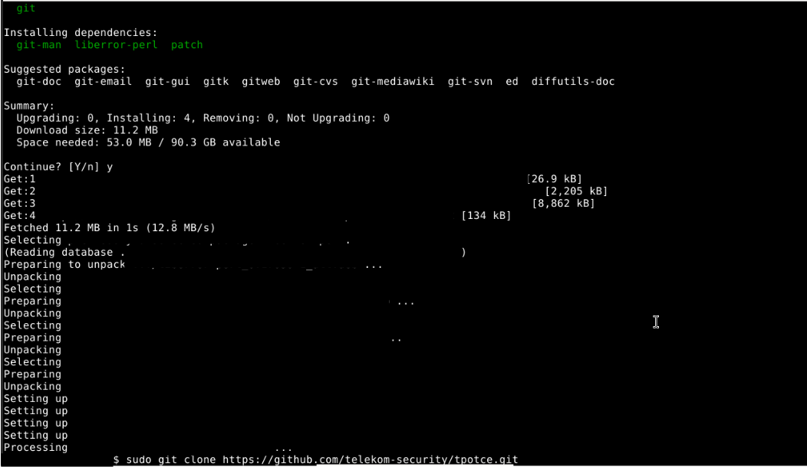
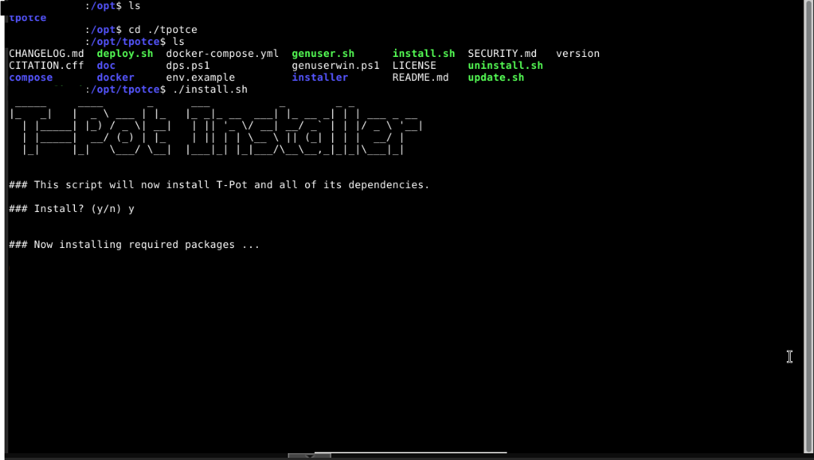

# T-Pot Honey Pot Deployment Lab 
#### This lab's purpose for me is to setup security researching so that I can monitor, and study the attacks that happen on a Honeyot.
#### Through studying active attacks that have occured, as a Blue team proffesional you can better pickup on indicators and threat actor artifacts left behind from attacks.

### Network Architecture 

#### To start, I installed a secondary Intel Network Interface Card inside of my proxmox host. I set up a bridge between all 4 ports on the new NIC.
#### Inside of OPNsense, I setup a Interface, and enable it. I configured strict firewall rules to block traffic from the dmz to our local LAN, I also setup allowing our LAN to access the DMZ if needed. Ports 443 and 80 are open on the DMZ to WAN. 

#### Here you can see there is no access back to the LAN subnet, but there is access out to the Internet.

#### Next i installed git, and then t-pot.

#### After those finish, I then reboot. Now SSH has been changed. Port 22 is no longer yours, but instead will be open to the world.I'll ssh back into the VM back from my device using my configured port.

#### Once I knew SSH works, I then pivoted to setting up access to the Web UI. I had to add another firewall rule to
