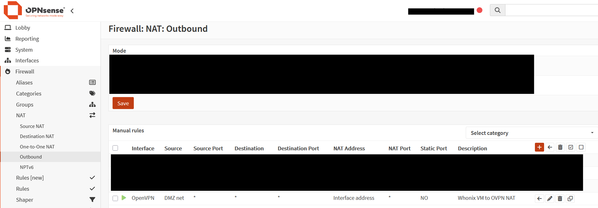
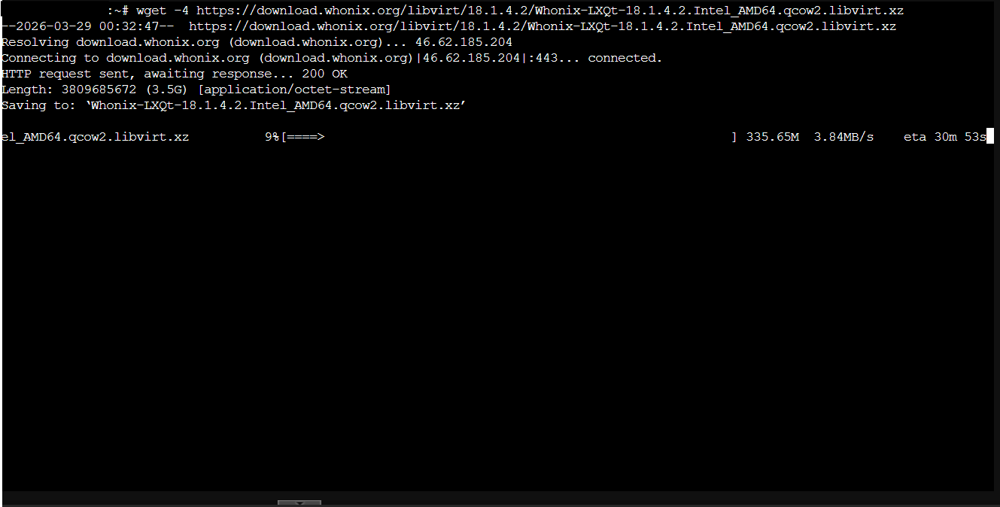

# Creating a Untraceable/Hard-To-Track Pentesting Machine

#### So for this lab, I wanted to create a pentesting device that would be either untraceable/hard to track.
#### To start, I signed up for OVPN's vpn provider service. They have a proven no-logs policy that was even upheld in court against the United States Goverment.
#### After signing up, I downloaded my Open VPN config file, along with seperate certificate files, we are going to install it on the firewall, and setup routing so that our DMZ interface from the tpot project (Here: [Honeypot Deployment](t-pot_deployment.md) ) will route directly to that VPN. We will then setup a WhoNix VM on my Proxmox Server that runs in my homelab.

#### Here are some firewall rules i created for this, this ensures all DMZ interface traffic leaves out of the Open VPN Instance, that is connected to OVPN in Sweden. The second rule is a backup killswitch rule incase the gateway goes down, it will ensure that the firewall doesnt try to push the DMZ traffic out through other gateways, this seperates the DMZ network traffic form the LAN even if implemented security control fails. (Changed a setting inside of Advanced system settings to turn off Force traffic through other networks when gateway goes down setting.)

#### I also needed to make a outbound NAT rule that would make sure all traffic on my DMZ interface would leave out of the OVPN Interface.

#### Now to go setup the WhoNix VM in Proxmox, and connect it to the DMZ. Inside of a shell on the ProxMox host I ran these commands:

#### wget -4 https://download.whonix.org/libvirt/18.1.4.2/Whonix-LXQt-18.1.4.2.Intel_AMD64.qcow2.libvirt.xz   (this downloads the WhoNix Archive)

#### unxz Whonix-LXQt-18.1.4.2.Intel_AMD64.qcow2.libvirt.xz (this unzips the archive)

#### tar xvf Whonix-LXQt-18.1.4.2.Intel_AMD64.qcow2.libvirt (this unpacks the tarball)

#### Once all of that was complete, I could then go setup the Network Adapters needed for both VM's. On the WhoNix Gateway, the VM gets two NICs one that is airgapped from all networks, and another NIC connected straight to the DMZ interface on the firewall. On the WhoNix Workstation, it gets 1 NIC the same airgapped one the gateway is connected to.

#### I then turned on my gateway, and let it go through its checks and set its self up on a TOR network. I was successfully able to connect to a tor network and utilize a tor browser! Now my traffic is obscured from my ISP, and the network traffic after the VPN is obscured aswell by travelling between two TOR nodes.

