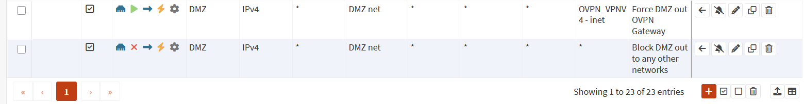

# Creating a Untraceable Pentesting Machine

#### So for this lab, I wanted to create a pentesting device that would be either untraceable/hard to track.
#### To start, I signed up for OVPN's vpn provider service. They have a proven no-logs policy that was even upheld in court against the United States Goverment.
#### After signing up, I downloaded my Open VPN config file, along with seperate certificate files, we are going to install it on the firewall, and setup routing so that our DMZ interface from the tpot project (Here: [Honeypot Deployment](t-pot_deployment.md) ) will route directly to that VPN. We will then setup a WhoNix VM on my Proxmox Server that runs in my homelab.

#### Here are some firewall rules i created for this, this ensures all DMZ interface traffic leaves out of the Open VPN Instance, that is connected to OVPN in Sweden. The second rule is a backup killswitch rule incase the gateway goes down, it will ensure that the firewall doesnt try to push the DMZ traffic out through other gateways, this seperates the DMZ network traffic form the LAN even if implemented security control fails. (Changed a setting inside of Advanced system settings to turn off Force traffic through other networks when gateway goes down setting.)

#### Now to go setup the WhoNix VM in Proxmox, and connect it to the DMZ.
